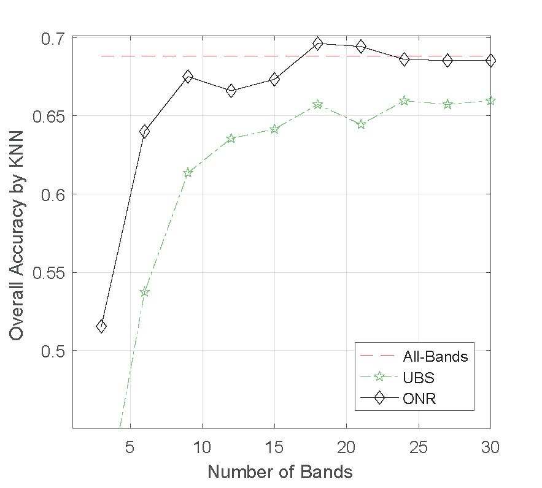
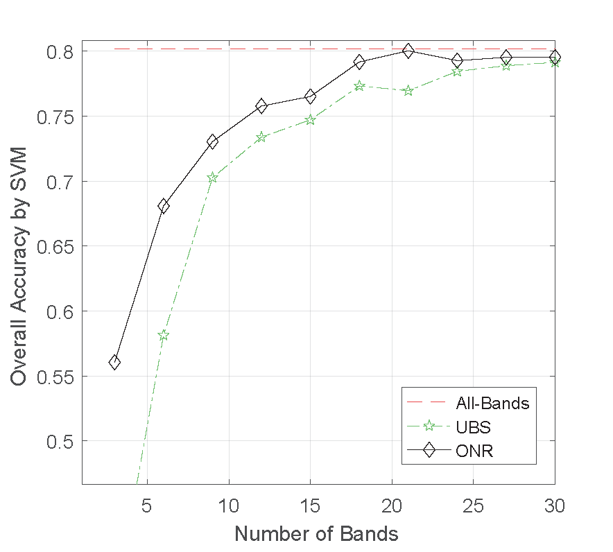
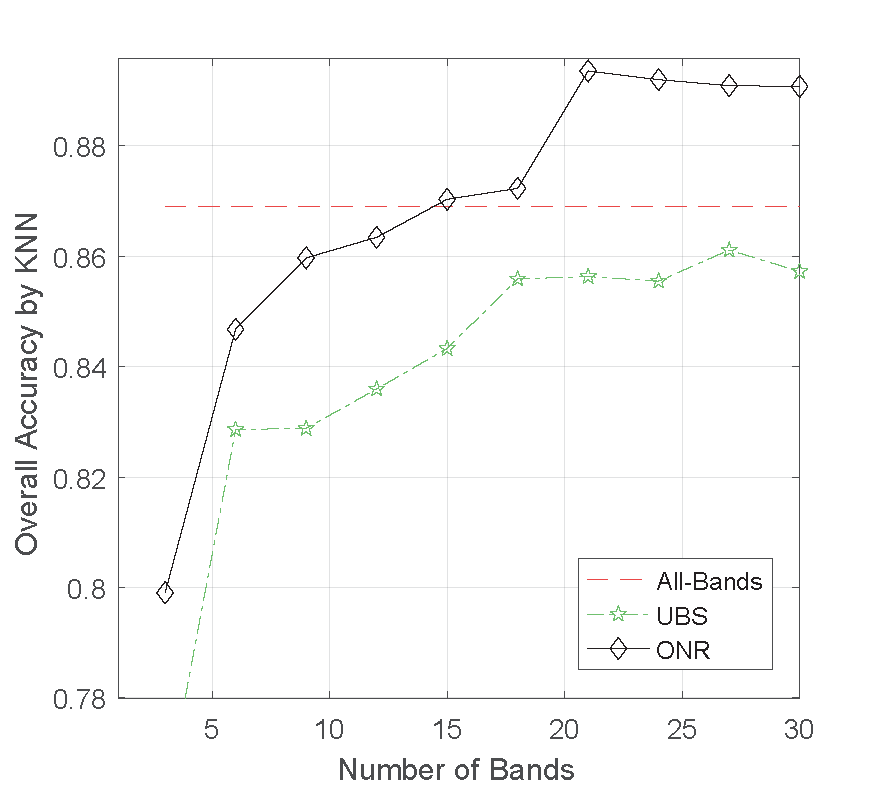
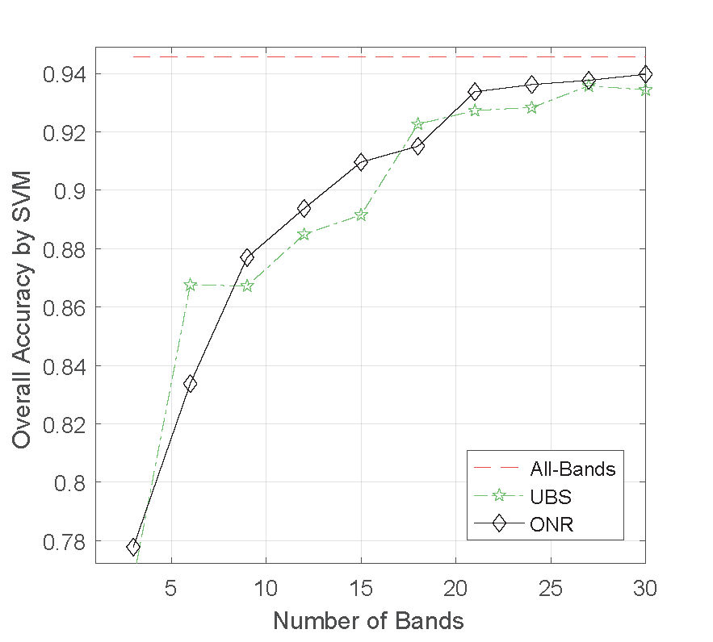
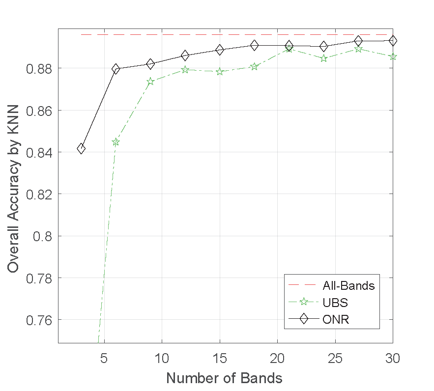
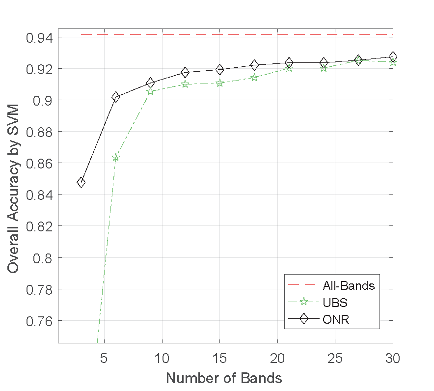
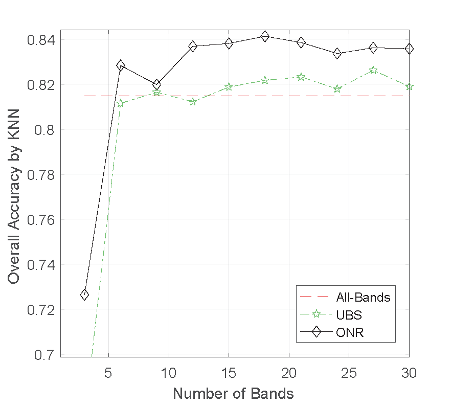
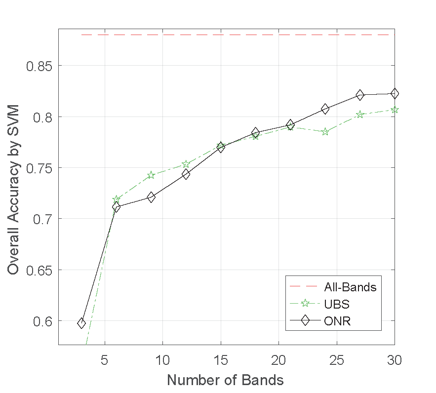
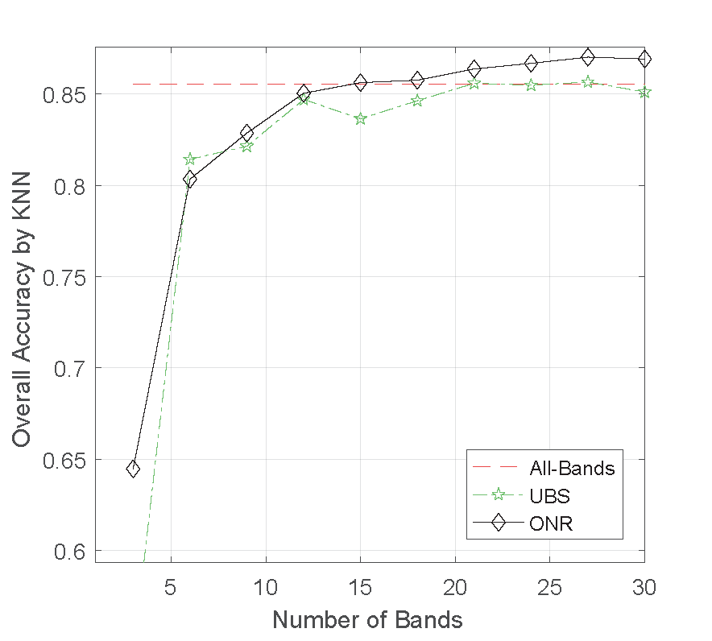
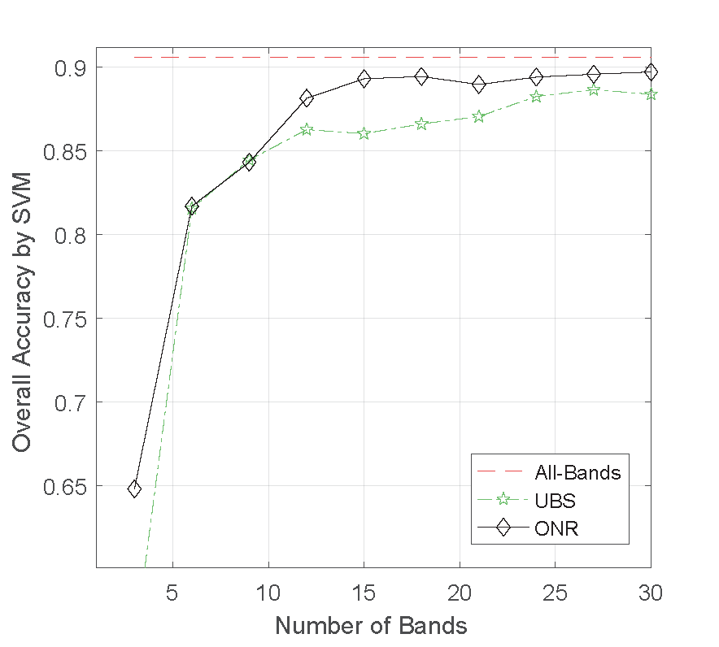

## Optimal Neighboring Reconstruction for Hyperspectral Band Selection

This repo provides a Matlab implementation of the conference paper "Hyperspectral Band Selection via Optimal Neighborhood Reconstruction", Transaction on Geoscience and Remote Sensing, 2020.

File 'demo.m' shows a simple and direct way to run the ONR algorithm by giving the hyperspectral dataset. 

File 'evaluation.m' provides an easily extended code framework to evaluate different band selection methods on different datasets. One can get a classification accuracy curve by running 'evaluation.m'.

Note that in order to successfully run 'evaluation.m', Libsvm for Matlab should be installed at first.
If you want to evaluate the algorithm on datasets other than Indian Pines, you should also download them in advance.

Link for Libsvm: [https://www.csie.ntu.edu.tw/~cjlin/libsvm/](https://www.csie.ntu.edu.tw/~cjlin/libsvm/)

Link for labeled hyperspectral image datasets: [http://www.ehu.eus/ccwintco/index.php/Hyperspectral_Remote_Sensing_Scenes](http://www.ehu.eus/ccwintco/index.php/Hyperspectral_Remote_Sensing_Scenes)

### Results

Indian Pines Dataset

Pavia University Dataset

Salinas Dataset

KSC Dataset

Botswana Dataset

Please kindly cite our paper if you use our code in your research. Thanks and hope you will benefit from our code. 

Q. Wang, F. Zhang, and X. Li, "Hyperspectral Band Selection via Optimal Neighborhood Reconstruction", Transaction on Geoscience and Remote Sensing (T-GRS), DOI: 10.1109/TGRS.2020.2987955, 2020
